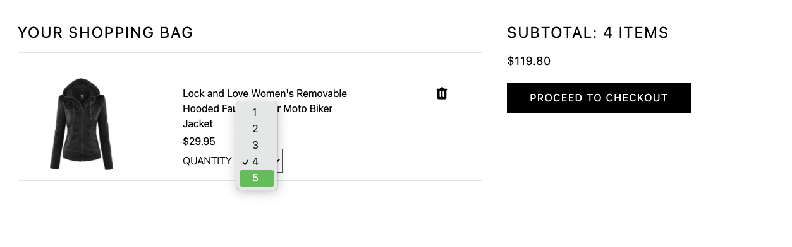

<!-- PROJECT LOGO -->
 

  <h3 align="center">MSTYLE E-commerce App</h3>

  

     
    <a href="https://mstyleecommerceapp.herokuapp.com/">View Demo</a>
  

<!-- TABLE OF CONTENTS -->

  
Table of Contents

  <ol>
    <li>
      <a href="#about-the-project">About The Project</a>
      <ul>
        <li><a href="#built-with">Built With</a></li>
      </ul>
    </li>
    <li>
      <a href="#getting-started">Getting Started</a>
      <ul>
        <li><a href="#prerequisites">Prerequisites</a></li>
        <li><a href="#installation">Installation</a></li>
      </ul>
    </li>
    <li><a href="#usage">Usage</a></li>
    <li><a href="#license">License</a></li>
    <li><a href="#contact">Contact</a></li>
    <li><a href="#acknowledgements">Acknowledgements</a></li>
  </ol>

<!-- ABOUT THE PROJECT -->

## About The Project

MStyle is a simulated e-commerce application. Source data was originally from [fakestore API](https://fakestoreapi.com/) and later modified with and stored in MongoDB. As a user, you can:

- View the whole list of products and check details of a single product of interest;
  &nbsp;

- Add a certain quantity of products to the shopping bag based on the amount of product in stock;
   &nbsp;
- Search a particular product of interest;
   &nbsp;
- Sort all products based on price, alphabetic, and rating;
   &nbsp;
- Change the number of products in the shopping bag
   &nbsp;
- Clear your shopping bag;
- Register, sign in and sign out;
- Checkout with your selected products and pay with PayPal (implemented with PayPal Sandbox)
   &nbsp;
- Review your orders when logged in;
- Update your user profile
   &nbsp;

### Built With

- [FakeStore API](https://fakestoreapi.com/)
- [React JS](https://reactjs.org/)
- [Redux](https://redux.js.org/)
- [Tailwind CSS](https://tailwindcss.com/)
- [Node.js](https://nodejs.org/en/)
- [Express](https://expressjs.com/)
- [MongoDB](https://www.mongodb.com/)
- [Mongoose](https://mongoosejs.com/docs/guide.html)

<!-- LICENSE -->

## License

Distributed under the MIT License. See `LICENSE` for more information.
